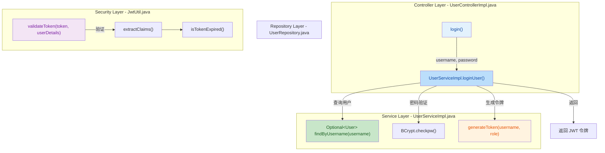

## 📋 高级摘要 (TL;DR)

*   **影响等级:** 中等 - 为 WealthCare 后端系统添加了完整的用户认证和登录功能
*   **核心变更:**
    *   ✨ 新增用户登录接口 (`/api/users/login`) 及对应服务层实现
    *   🔐 添加用户名查找方法 `findByUsername()` 到数据访问层
    *   🎫 完善 JWT 工具类，实现令牌生成与验证逻辑
    *   🔑 引入 BCrypt 密码加密验证机制，增强安全性

---

## 🗺️ 逻辑架构图

---

## 📝 详细变更分析

### 1️⃣ Controller 层 - `UserControllerImpl.java`

**变更说明:**
新增了用户登录的 HTTP 接口入口，处理登录请求并返回 JWT 令牌。

**关键代码逻辑:**
- 新增 `login(@RequestBody LoginRequest loginRequest)` 方法
- 调用 Service 层进行用户认证
- 成功时返回包含 JWT 令牌的响应

---

### 2️⃣ Service 层 - `UserServiceImpl.java`

**变更说明:**
实现用户登录的核心业务逻辑，包括用户查找、密码验证和令牌生成。

**核心方法变更表:**

| 方法名 | 功能 | 输入参数 | 返回值 |
|--------|------|----------|--------|
| `loginUser()` | 用户登录认证 | `username`, `password` | `String` (JWT Token) |

**逻辑流程:**
1. 通过 `userRepository.findByUsername()` 查找用户
2. 使用 `BCryptPasswordEncoder` 验证密码
3. 密码正确时，调用 `jwtUtil.generateToken()` 生成 JWT
4. 验证失败抛出 `RuntimeException`

---

### 3️⃣ Repository 层 - `UserRepository.java`

**变更说明:**
扩展数据访问接口，新增按用户名查询的方法，用于登录认证。

**方法变更表:**

| 方法签名 | 返回类型 | 说明 |
|----------|----------|------|
| `Optional<User> findByUsername(String username)` | `Optional<User>` | 根据用户名查找用户记录 |

---

### 4️⃣ 安全工具类 - `JwtUtil.java`

**变更说明:**
完善 JWT 令牌的生成、解析和验证功能，支持基于角色的访问控制。

**核心功能表:**

| 方法名 | 功能 | 关键参数 |
|--------|------|----------|
| `generateToken()` | 生成 JWT 令牌 | `username`, `role`, `expiration` |
| `extractUsername()` | 从令牌提取用户名 | `token` |
| `extractRole()` | 从令牌提取角色 | `token` |
| `validateToken()` | 验证令牌有效性 | `token`, `UserDetails` |
| `extractClaims()` | 解析令牌声明 | `token` |
| `isTokenExpired()` | 检查令牌是否过期 | `token` |

**关键配置:**
- **签名密钥**: `your-secret-key-should-be-long-enough`
- **令牌有效期**: 24 小时 (`86400000` 毫秒)

---

## ⚠️ 影响与风险评估

### ✅ 积极影响
- 提供了完整的用户认证机制，支持基于 JWT 的无状态会话管理
- 使用 BCrypt 加密存储密码，符合安全最佳实践
- 令牌包含角色信息，便于后续权限控制

### ⚠️ 风险点

| 风险类型 | 描述 | 建议 |
|----------|------|------|
| **密钥硬编码** | JWT 签名密钥直接写在代码中 | ⚠️ 应移至配置文件或环境变量 |
| **无刷新令牌** | 只有访问令牌，无刷新机制 | 考虑添加令牌刷新机制 |
| **错误信息泄露** | 直接抛出异常可能泄露用户存在性 | 统一错误提示 |

### 🧪 测试建议

**高优先级场景:**
1. ✅ 正确的用户名和密码登录成功，获取有效 JWT
2. ❌ 错误的用户名登录失败
3. ❌ 正确用户名但错误密码登录失败
4. ✅ 使用生成的 JWT 访问受保护资源
5. ❌ 过期的 JWT 被拒绝
6. ❌ 篡改的 JWT 被拒绝

**边界测试:**
- 空用户名或空密码的处理
- 特殊字符在用户名中的处理
- 并发登录场景

---

## 🔧 依赖关系

本次变更使用的技术栈保持稳定：

| 技术组件 | 用途 |
|----------|------|
| Spring Boot | 应用框架 |
| Spring Data JPA | 数据访问 |
| JWT (io.jsonwebtoken) | 令牌生成与验证 |
| BCrypt | 密码加密 |