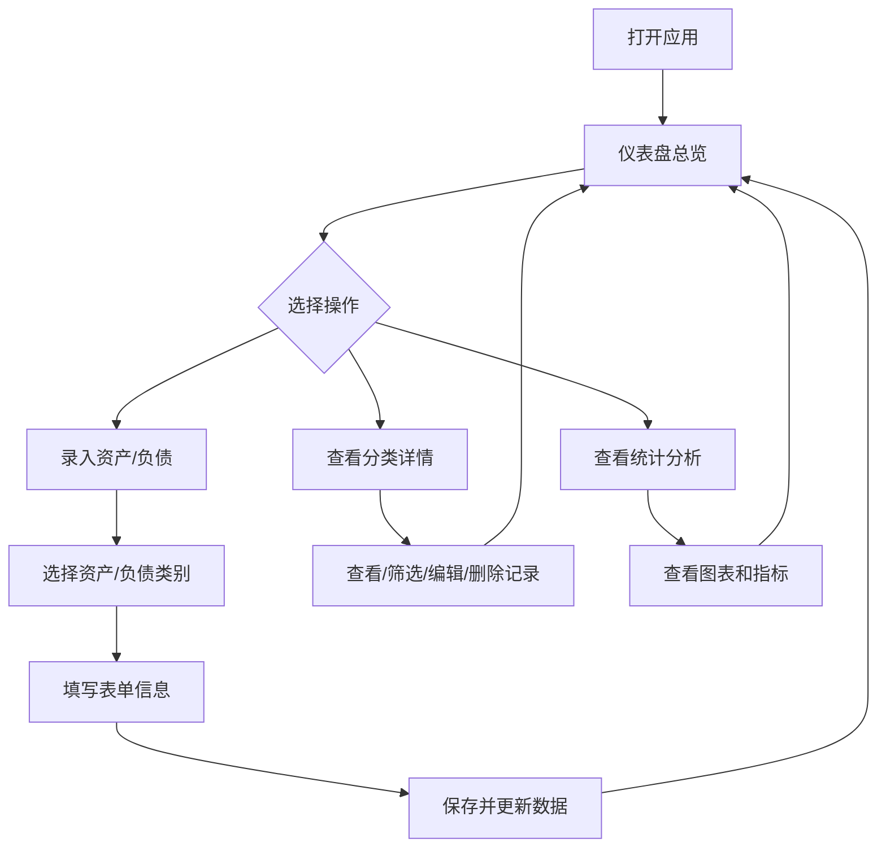

# 个人财产管理工具 - 产品需求文档

## 1. 产品概述

一款面向个人用户的财产管理工具，帮助用户收集、录入、整理和统计个人资产与负债情况。通过直观的仪表盘和分类管理，让用户清晰掌握自身财务状况。

- 主要用途：个人资产全景视图、分类管理、统计分析
- 目标用户：有资产管理需求的个人用户
- 核心价值：一站式掌握个人财务健康状况

## 2. 核心功能

### 2.1 用户角色

| 角色 | 注册方式 | 核心权限 |
|------|----------|----------|
| 个人用户 | 无需注册（本地单用户） | 全部功能：录入、查看、筛选、统计、导出数据 |

### 2.2 功能模块

1. **仪表盘总览**：资产全景、净资产概览、分类占比、近期变动列表
2. **银行存款管理**：活期/定期存款录入、编辑、删除、汇总，支持按银行名称、户名、定/活期筛选
3. **证券投资管理**：证券资产录入与市值跟踪，支持按机构名称、户名筛选
4. **理财和基金管理**：理财产品、基金管理，支持按机构名称、户名筛选
5. **其他资产管理**：自定义资产类别录入与管理，支持按资产名称、户名筛选
6. **贷款管理**：房贷、车贷、消费贷等贷款管理
7. **信用卡管理**：信用卡欠款管理
8. **其他负债管理**：自定义负债类别录入与管理
9. **统计分析**：资产结构分析、负债结构分析、资产负债月度趋势、按月汇总表、负债率计算、净资产趋势、分类对比
10. **设置**：指定数据库文件存放位置，支持切换/恢复默认位置，切换后自动重新加载数据

### 2.3 资产分类与数据结构

#### 2.3.1 银行存款（bank_deposit）

| 字段 | 说明 | 是否必填 |
|------|------|----------|
| bankName | 银行名称 | 是 |
| accountName | 户名 | 是 |
| depositType | 定/活期（fixed/demand） | 是 |
| amount | 金额 | 是 |
| depositDate | 存入日期 | 是 |
| term | 期限（单位：年，可为小数，如 0.5 表示半年） | 否 |
| interestRate | 利率（百分比，如 3 表示 3%） | 否 |
| maturityDate | 到期日（系统自动计算：存入日期 + 期限） | 自动计算 |
| maturityAmount | 到期金额（系统自动计算：金额 × (1 + 期限 × 利率 / 100)） | 自动计算 |
| notes | 备注 | 否 |

#### 2.3.2 证券投资（securities）

| 字段 | 说明 | 是否必填 |
|------|------|----------|
| institution | 机构名称 | 是 |
| accountName | 户名 | 是 |
| principal | 本金 | 是 |
| currentValue | 现值 | 是 |
| profit | 收益（系统自动计算：现值 - 本金） | 自动计算 |
| notes | 备注 | 否 |

#### 2.3.3 理财和基金（fund_wealth）

| 字段 | 说明 | 是否必填 |
|------|------|----------|
| institution | 机构名称 | 是 |
| accountName | 户名 | 是 |
| productName | 产品名称 | 是 |
| principal | 本金 | 是 |
| purchaseDate | 购买日期 | 是 |
| term | 期限 | 否 |
| profit | 收益（系统自动计算：现值 - 本金） | 自动计算 |
| maturityDate | 到期日 | 否 |
| currentValue | 现值 | 是 |
| notes | 备注 | 否 |

#### 2.3.4 其他资产（other_asset）

| 字段 | 说明 | 是否必填 |
|------|------|----------|
| assetName | 资产名称 | 是 |
| accountName | 户名 | 是 |
| productName | 产品名称 | 是 |
| principal | 本金 | 是 |
| term | 期限 | 否 |
| profit | 收益（系统自动计算：现值 - 本金） | 自动计算 |
| currentValue | 现值 | 是 |
| maturityDate | 到期日 | 否 |
| notes | 备注 | 否 |

### 2.4 负债分类与数据结构

#### 2.4.1 贷款（loan）

| 字段 | 说明 | 是否必填 |
|------|------|----------|
| loanName | 贷款名称 | 是 |
| accountName | 户名 | 是 |
| amount | 金额 | 是 |
| startDate | 开始日期 | 是 |
| liabilityAmount | 负债金额 | 是 |
| interestRate | 利率 | 否 |
| expectedRepaymentDate | 预期还款日 | 否 |
| isInstallment | 是否分期 | 否 |
| installmentAmount | 每期还款金额 | 否 |
| notes | 备注 | 否 |

#### 2.4.2 信用卡（credit_card）

| 字段 | 说明 | 是否必填 |
|------|------|----------|
| institution | 发卡机构 | 是 |
| accountName | 户名 | 是 |
| amount | 金额 | 是 |
| interestRate | 利率 | 否 |
| repaymentDate | 到期还款日 | 否 |
| notes | 备注 | 否 |

#### 2.4.3 其他负债（other_liability）

| 字段 | 说明 | 是否必填 |
|------|------|----------|
| loanName | 贷款名称 | 是 |
| accountName | 户名 | 是 |
| amount | 金额 | 是 |
| startDate | 开始日期 | 是 |
| liabilityAmount | 负债金额 | 是 |
| interestRate | 利率 | 否 |
| expectedRepaymentDate | 预期还款日 | 否 |
| isInstallment | 是否分期 | 否 |
| installmentAmount | 每期还款金额 | 否 |
| notes | 备注 | 否 |

### 2.5 资产筛选功能

资产管理页面支持按以下条件筛选记录，帮助用户快速定位数据：

| 筛选条件 | 适用分类 | 筛选方式 | 说明 |
|----------|----------|----------|------|
| 机构名称 | 全部资产分类 | 文本模糊匹配（不区分大小写） | 银行存款按"银行名称"、证券/理财按"机构名称"、其他资产按"资产名称"筛选 |
| 户名 | 全部资产分类 | 文本模糊匹配（不区分大小写） | 按 accountName 字段筛选 |
| 定/活期 | 仅银行存款 | 下拉选择（全部/定期/活期） | 按 depositType 字段筛选 |

**筛选交互规则：**
- 多个筛选条件之间为「与」关系，同时满足才显示
- 切换资产分类标签时自动重置所有筛选条件
- 有筛选生效时显示「重置」按钮，可一键清空所有筛选
- 记录数显示「（已筛选）」标识，提示当前为筛选结果

### 2.6 页面详情

| 页面名称 | 模块名称 | 功能描述 |
|----------|----------|----------|
| 仪表盘 | 资产概览卡片 | 展示总资产、总负债、净资产、负债率四个核心指标 |
| 仪表盘 | 资产分布饼图 | 按类别展示资产占比（银行存款、证券、理财基金、其他资产） |
| 仪表盘 | 负债分布饼图 | 按类别展示负债占比（贷款、信用卡、其他负债） |
| 仪表盘 | 近期变动列表 | 展示最近添加/修改/删除的资产/负债记录（最多 50 条） |
| 资产管理 | 分类标签页 | 银行存款、证券投资、理财基金、其他资产四个分类切换 |
| 资产管理 | 筛选区域 | 按机构名称、户名、定/活期筛选当前分类下的资产记录 |
| 资产管理 | 资产列表 | 表格展示已录入资产，支持编辑和删除 |
| 资产管理 | 录入/编辑表单 | 弹窗表单，按分类动态展示字段，自动计算到期日/到期金额/收益 |
| 负债管理 | 分类标签页 | 贷款、信用卡、其他负债三个分类切换 |
| 负债管理 | 负债列表 | 表格展示已录入负债，支持编辑和删除 |
| 负债管理 | 录入/编辑表单 | 弹窗表单，按分类动态展示字段 |
| 统计分析 | 资产结构分析 | 饼图展示各类资产占比 |
| 统计分析 | 负债结构分析 | 饼图展示各类负债占比 |
| 统计分析 | 资产负债对比 | 柱状图对比各分类金额 |
| 统计分析 | 资产负债月度趋势 | 折线图展示按月汇总的资产、负债、净资产走势 |
| 统计分析 | 按月汇总表 | 表格展示每月资产总额、负债总额、净资产 |
| 统计分析 | 关键指标 | 负债率等 |
| 设置 | 数据库位置 | 显示当前数据库文件路径，区分默认/自定义位置 |
| 设置 | 切换位置 | 选择新目录作为数据库存放位置，切换后自动重新加载数据 |
| 设置 | 恢复默认 | 一键恢复到默认数据库位置（%APPDATA%/WealthCare/WealthCare.db） |
| 设置 | 注意事项 | 提示切换位置不会自动迁移原数据，需手动复制 db 文件 |

## 3. 核心流程

用户打开应用后，首先进入仪表盘查看资产全景。通过导航进入各分类管理页面，录入新的资产或负债信息。系统自动计算汇总数据并更新仪表盘，同时记录变动历史。用户可在资产管理页面使用筛选功能快速定位记录，在统计分析页面查看详细的资产结构和趋势分析。

## 4. 用户界面设计

### 4.1 设计风格

- **主色调**：深墨绿（#1a3a3a）+ 金色（#c9a96e）— 传达稳重、财富、专业感
- **辅助色**：暖灰（#f5f0eb）背景、深灰（#2d2d2d）文字
- **按钮风格**：圆角矩形，带微妙阴影，hover 时金色渐变
- **字体**：标题使用 Playfair Display（衬线体，传达典雅），正文使用 Source Han Sans / Noto Sans SC
- **布局风格**：左侧导航 + 右侧内容区，卡片式信息展示
- **图标风格**：线性图标（lucide-react），金色描边

### 4.2 页面设计概览

| 页面名称 | 模块名称 | UI 元素 |
|----------|----------|---------|
| 仪表盘 | 资产概览卡片 | 四宫格卡片，数字动画，金色图标，渐变背景 |
| 仪表盘 | 饼图区域 | 环形图，金色/绿色配色，hover 显示详情 |
| 仪表盘 | 近期变动 | 时间线列表，左侧图标标识类型 |
| 资产管理 | 分类标签页 | 顶部标签切换，选中项金色下划线 |
| 资产管理 | 筛选区域 | 卡片式筛选面板，文本输入框 + 下拉选择，重置按钮 |
| 资产管理 | 列表区域 | 表格展示，hover 高亮，操作列含编辑/删除按钮 |
| 资产管理 | 表单弹窗 | 居中弹窗，分字段表单，提交/取消按钮 |
| 负债管理 | 分类标签页 | 顶部标签切换，选中项金色下划线 |
| 负债管理 | 列表区域 | 表格展示，hover 高亮，操作列含编辑/删除按钮 |
| 统计分析 | 图表区域 | 多种图表类型，支持切换视图 |

### 4.3 响应式

- 桌面端优先设计
- 支持 1024px 以上屏幕
- 移动端自适应（导航折叠为汉堡菜单，卡片单列排列，筛选区单列布局）

### 4.4 3D 场景指导

不适用（本工具为数据管理型应用，无需 3D 场景）

## 5. 验收条件

### 5.1 功能验收

| 模块 | 验收项 | 通过标准 |
|------|--------|----------|
| 仪表盘 | 核心指标展示 | 正确显示总资产、总负债、净资产、负债率 |
| 资产管理 | 录入资产 | 每种分类可正常添加、编辑、删除 |
| 资产管理 | 银行存款自动计算 | 输入金额/期限/利率后，到期金额按公式 `金额 × (1 + 期限 × 利率 / 100)` 计算并显示 |
| 资产管理 | 银行存款到期日计算 | 输入存入日期和期限（年）后，到期日自动按 `存入日期 + 期限` 计算并显示 |
| 资产管理 | 收益自动计算 | 证券/理财/其他资产的收益字段为只读，值等于 `现值 - 本金` |
| 资产管理 | 筛选功能 | 按机构名称、户名、定/活期筛选后结果正确，重置后恢复 |
| 资产管理 | 列表排序 | 资产列表默认按到期日升序排序；点击表头可按字段升/降序排序 |
| 负债管理 | 录入负债 | 贷款、信用卡、其他负债可正常添加、编辑、删除 |
| 负债管理 | 列表排序 | 负债列表默认按还款日升序排序；点击表头可按字段升/降序排序 |
| 统计分析 | 图表展示 | 资产分布、负债分布、资产负债月度趋势等图表正常渲染 |
| 统计分析 | 按月汇总 | 资产按存入/购买日期、负债按开始日期/还款日分组到月份，汇总金额正确 |
| 统计分析 | 按月汇总表 | 表格展示每月资产总额、负债总额、净资产，无数据时显示提示 |
| 设置 | 数据库位置 | 可切换数据库文件存放位置，切换后自动加载新位置的 db 文件 |
| 设置 | 恢复默认 | 可一键恢复默认数据库位置，恢复后加载默认位置的 db 文件 |

### 5.2 数据验收

| 验收项 | 通过标准 |
|--------|----------|
| 数据持久化 | 重启应用后资产/负债/变动记录不丢失 |
| SQLite 存储 | 数据保存到本地 SQLite 文件（默认 `%APPDATA%/wealth-tracker/wealth-tracker.db`） |
| 配置独立 | 数据库路径配置保存在 `%APPDATA%/wealth-tracker/config.json`，与 db 文件分离 |
| LocalStorage 迁移 | 首次从老版本 LocalStorage 启动时，数据可自动迁移到 SQLite |
| undefined 参数 | 所有写入 SQLite 的参数均做过默认值处理，不会触发 sql.js 的 undefined 绑定错误 |

### 5.3 Windows 安装包验收

| 验收项 | 通过标准 |
|--------|----------|
| 可安装包构建 | 执行 `npm run build:win:setup` 成功生成 Windows 安装程序（NSIS `.exe`） |
| 可安装包安装 | 在 Windows 10/11 上双击安装程序，可完成安装并创建开始菜单/桌面快捷方式 |
| 安装后运行 | 从开始菜单或桌面快捷方式启动应用，可正常进入仪表盘 |
| 安装目录 | 默认安装到 `%LOCALAPPDATA%/WealthCare`，卸载程序可正常移除 |
| 目录版构建 | 执行 `npm run build:win:dir` 成功生成 `dist-electron/win-unpacked/WealthCare.exe`，可直接运行 |
| 单文件版构建 | 执行 `npm run build:win:portable` 成功生成单文件 portable exe |
| 打包产物 | 所有产物均位于 `dist-electron/` 目录下 |

### 5.4 稳定性验收

| 验收项 | 通过标准 |
|--------|----------|
| 开发模式 | `npm run dev:electron` 正常启动 Electron 并加载页面 |
| 浏览器模式 | `npm run dev` 可在浏览器中运行，LocalStorage 回退正常 |
| TypeScript | `npx tsc --noEmit` 无类型错误 |
| 应用退出 | 正常关闭窗口后数据库文件完整，无数据损坏 |
| 路径切换 | 切换数据库路径后，原数据不自动迁移，新路径无数据时显示空库 |

### 5.5 兼容性验收

| 验收项 | 通过标准 |
|--------|----------|
| Windows 平台 | 应用仅面向 Windows 发布，在 Windows 10/11 x64 上运行 |
| 显示分辨率 | 主窗口最小尺寸 1024×768，推荐 1400×900，适配常见桌面分辨率 |
| 无 JVM 依赖 | 不依赖 H2/JVM，使用 sql.js 纯 WASM 实现 |
| 无 Clang 编译 | 不依赖 better-sqlite3 原生编译，避免 ClangCL 环境问题 |
