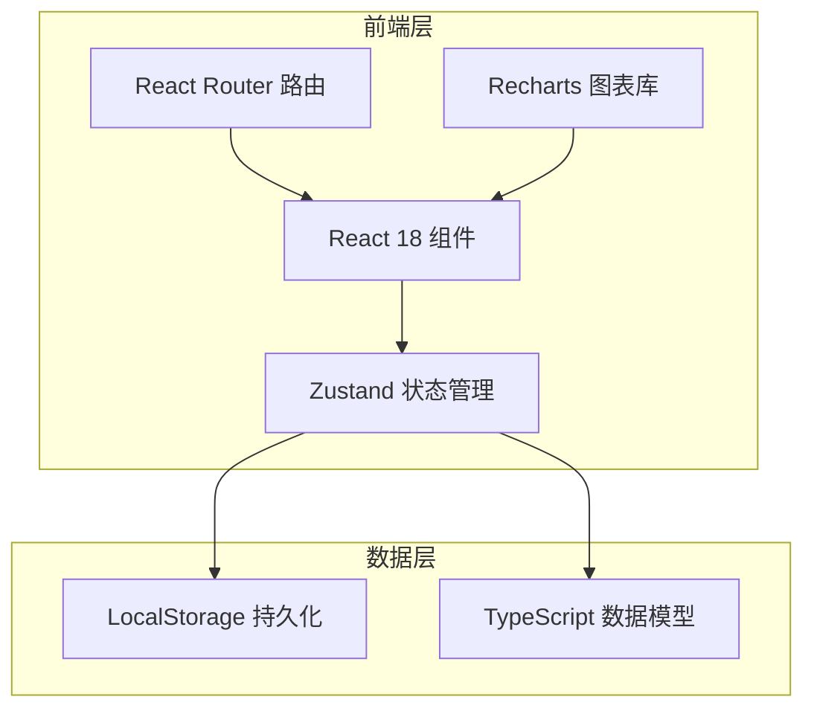
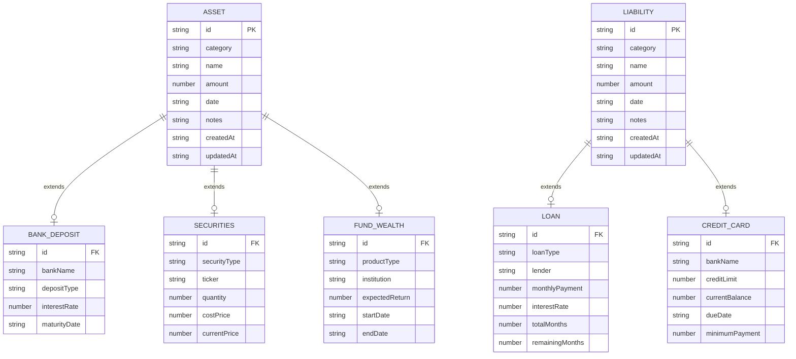

# 个人财产管理工具 - 技术架构文档

## 1. 架构设计



## 2. 技术描述

- **前端**：React 18 + TypeScript + Vite
- **样式**：Tailwind CSS 3
- **状态管理**：Zustand（轻量级，适合单用户应用）
- **图表库**：Recharts（React 原生图表库）
- **路由**：React Router v6
- **数据持久化**：LocalStorage（无需后端，数据存本地）
- **后端**：无（纯前端应用）
- **初始化**：Vite + React + TypeScript 模板

## 3. 路由定义

| 路由 | 用途 |
|------|------|
| `/` | 仪表盘总览（默认首页） |
| `/assets` | 资产录入与管理（银行存款、证券、理财基金） |
| `/liabilities` | 负债管理（贷款、信用卡） |
| `/analysis` | 统计分析与图表 |

## 4. API 定义

本应用为纯前端，无后端 API。数据通过 Zustand store 管理并持久化到 LocalStorage。

### 4.1 数据模型类型定义

```typescript
// 资产基础类型
interface Asset {
  id: string;
  category: 'bank_deposit' | 'securities' | 'fund_wealth';
  name: string;          // 资产名称
  amount: number;        // 金额
  date: string;          // 录入日期
  notes?: string;        // 备注
  createdAt: string;
  updatedAt: string;
}

// 银行存款
interface BankDeposit extends Asset {
  category: 'bank_deposit';
  bankName: string;      // 银行名称
  depositType: 'demand' | 'fixed'; // 活期/定期
  interestRate?: number; // 利率
  maturityDate?: string; // 到期日
}

// 证券投资
interface Securities extends Asset {
  category: 'securities';
  securityType: 'stock' | 'bond' | 'other'; // 股票/债券/其他
  ticker?: string;       // 证券代码
  quantity?: number;     // 数量
  costPrice?: number;    // 成本价
  currentPrice?: number; // 当前价
}

// 理财和基金
interface FundWealth extends Asset {
  category: 'fund_wealth';
  productType: 'wealth_management' | 'mutual_fund' | 'private_fund'; // 理财/公募/私募
  institution: string;   // 发行机构
  expectedReturn?: number; // 预期收益率
  startDate?: string;    // 起息日
  endDate?: string;      // 到期日
}

// 负债基础类型
interface Liability {
  id: string;
  category: 'loan' | 'credit_card';
  name: string;
  amount: number;        // 欠款余额
  date: string;
  notes?: string;
  createdAt: string;
  updatedAt: string;
}

// 贷款
interface Loan extends Liability {
  category: 'loan';
  loanType: 'mortgage' | 'car_loan' | 'consumer_loan' | 'other'; // 房贷/车贷/消费贷/其他
  lender: string;        // 贷款机构
  monthlyPayment?: number; // 月供
  interestRate?: number; // 利率
  totalMonths?: number;  // 总期数
  remainingMonths?: number; // 剩余期数
}

// 信用卡
interface CreditCard extends Liability {
  category: 'credit_card';
  bankName: string;      // 发卡银行
  creditLimit: number;   // 信用额度
  currentBalance: number; // 当前欠款
  dueDate?: string;      // 还款日
  minimumPayment?: number; // 最低还款
}

// 汇总统计
interface FinancialSummary {
  totalAssets: number;
  totalLiabilities: number;
  netWorth: number;
  debtRatio: number;     // 负债率 = 总负债/总资产
  assetBreakdown: {
    bankDeposit: number;
    securities: number;
    fundWealth: number;
  };
  liabilityBreakdown: {
    loan: number;
    creditCard: number;
  };
}
```

## 5. 服务器架构图

不适用（纯前端应用，无服务器）

## 6. 数据模型

### 6.1 数据模型定义



### 6.2 数据存储方式

使用 LocalStorage 存储 JSON 格式数据：

```typescript
// LocalStorage keys
const STORAGE_KEYS = {
  ASSETS: 'wealth_tracker_assets',
  LIABILITIES: 'wealth_tracker_liabilities',
};
```

无需 DDL 语句（无数据库）。
