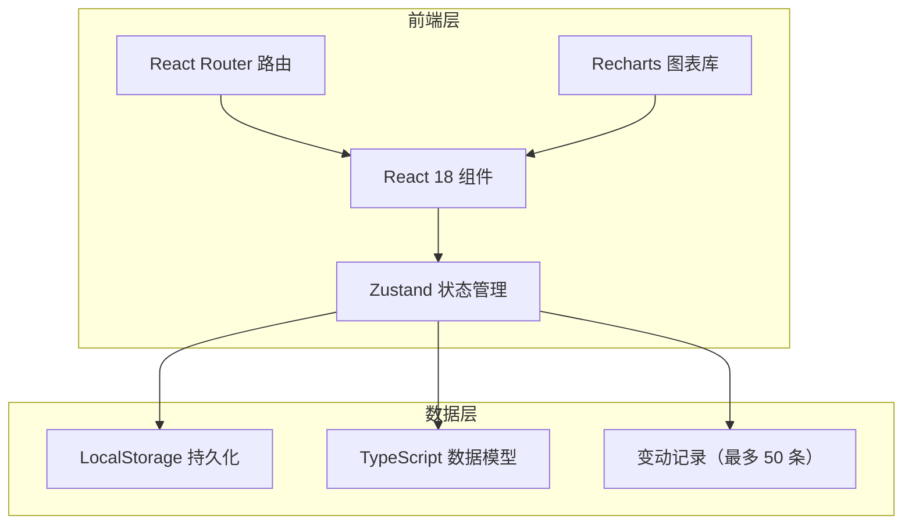
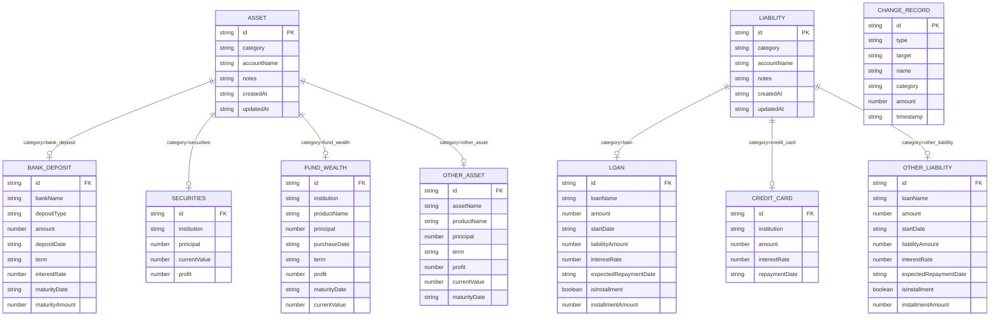

# 个人财产管理工具 - 技术架构文档

## 1. 架构设计



## 2. 技术描述

- **前端**：React 18 + TypeScript + Vite
- **样式**：Tailwind CSS 3
- **状态管理**：Zustand（轻量级，适合单用户应用）
- **图表库**：Recharts（React 原生图表库）
- **路由**：React Router v6
- **图标库**：lucide-react（线性图标）
- **数据持久化**：LocalStorage（无需后端，数据存本地）
- **后端**：无（纯前端应用）
- **初始化**：Vite + React + TypeScript 模板

## 3. 路由定义

| 路由 | 用途 |
|------|------|
| `/` | 仪表盘总览（默认首页） |
| `/assets` | 资产管理（银行存款、证券投资、理财基金、其他资产） |
| `/liabilities` | 负债管理（贷款、信用卡、其他负债） |
| `/analysis` | 统计分析与图表 |

## 4. API 定义

本应用为纯前端，无后端 API。数据通过 Zustand store 管理并持久化到 LocalStorage。

### 4.1 数据模型类型定义

```typescript
// 资产类别
type AssetCategory = 'bank_deposit' | 'securities' | 'fund_wealth' | 'other_asset';

// 负债类别
type LiabilityCategory = 'loan' | 'credit_card' | 'other_liability';

// 银行存款
interface BankDeposit {
  id: string;
  category: 'bank_deposit';
  bankName: string;        // 银行名称
  accountName: string;     // 户名
  depositType: 'demand' | 'fixed'; // 定/活期
  amount: number;          // 金额
  depositDate: string;     // 存入日期
  term?: string;           // 期限
  interestRate?: number;   // 利率
  maturityDate?: string;   // 到期日
  maturityAmount?: number; // 到期金额（自动计算）
  notes?: string;          // 备注
  createdAt: string;
  updatedAt: string;
}

// 证券投资
interface Securities {
  id: string;
  category: 'securities';
  institution: string;     // 机构名称
  accountName: string;     // 户名
  principal: number;       // 本金
  currentValue: number;    // 现值
  profit: number;          // 收益（自动计算）
  notes?: string;          // 备注
  createdAt: string;
  updatedAt: string;
}

// 理财和基金
interface FundWealth {
  id: string;
  category: 'fund_wealth';
  institution: string;     // 机构名称
  accountName: string;     // 户名
  productName: string;     // 产品名称
  principal: number;       // 本金
  purchaseDate: string;    // 购买日期
  term?: string;           // 期限
  profit: number;          // 收益（自动计算）
  maturityDate?: string;   // 到期日
  currentValue: number;    // 现值
  notes?: string;          // 备注
  createdAt: string;
  updatedAt: string;
}

// 其他资产
interface OtherAsset {
  id: string;
  category: 'other_asset';
  assetName: string;       // 资产名称
  accountName: string;     // 户名
  productName: string;     // 产品名称
  principal: number;       // 本金
  term?: string;           // 期限
  profit: number;          // 收益（自动计算）
  currentValue: number;    // 现值
  maturityDate?: string;   // 到期日
  notes?: string;          // 备注
  createdAt: string;
  updatedAt: string;
}

type AnyAsset = BankDeposit | Securities | FundWealth | OtherAsset;

// 贷款
interface Loan {
  id: string;
  category: 'loan';
  loanName: string;          // 贷款名称
  accountName: string;       // 户名
  amount: number;            // 金额
  startDate: string;         // 开始日期
  liabilityAmount: number;   // 负债金额
  interestRate?: number;     // 利率
  expectedRepaymentDate?: string; // 预期还款日
  isInstallment?: boolean;   // 是否分期
  installmentAmount?: number; // 每期还款金额
  notes?: string;            // 备注
  createdAt: string;
  updatedAt: string;
}

// 信用卡
interface CreditCard {
  id: string;
  category: 'credit_card';
  institution: string;       // 发卡机构
  accountName: string;       // 户名
  amount: number;            // 金额
  interestRate?: number;     // 利率
  repaymentDate?: string;    // 到期还款日
  notes?: string;            // 备注
  createdAt: string;
  updatedAt: string;
}

// 其他负债
interface OtherLiability {
  id: string;
  category: 'other_liability';
  loanName: string;          // 贷款名称
  accountName: string;       // 户名
  amount: number;            // 金额
  startDate: string;         // 开始日期
  liabilityAmount: number;   // 负债金额
  interestRate?: number;     // 利率
  expectedRepaymentDate?: string; // 预期还款日
  isInstallment?: boolean;   // 是否分期
  installmentAmount?: number; // 每期还款金额
  notes?: string;            // 备注
  createdAt: string;
  updatedAt: string;
}

type AnyLiability = Loan | CreditCard | OtherLiability;

// 变动记录
interface ChangeRecord {
  id: string;
  type: 'add' | 'edit' | 'delete';
  target: 'asset' | 'liability';
  name: string;
  category: string;
  amount: number;
  timestamp: string;
}

// 汇总统计
interface FinancialSummary {
  totalAssets: number;
  totalLiabilities: number;
  netWorth: number;
  debtRatio: number;     // 负债率 = 总负债/总资产
  assetBreakdown: {
    bankDeposit: number;
    securities: number;
    fundWealth: number;
    otherAsset: number;
  };
  liabilityBreakdown: {
    loan: number;
    creditCard: number;
    otherLiability: number;
  };
}
```

### 4.2 自动计算规则

| 资产类别 | 计算字段 | 计算公式 |
|----------|----------|----------|
| 银行存款 | maturityAmount（到期金额） | amount × (1 + term × interestRate) |
| 证券投资 | profit（收益） | currentValue - principal |
| 理财和基金 | profit（收益） | currentValue - principal |
| 其他资产 | profit（收益） | currentValue - principal |

### 4.3 Store 接口定义

```typescript
interface WealthState {
  assets: AnyAsset[];
  liabilities: AnyLiability[];
  changes: ChangeRecord[];

  // 资产 CRUD
  addAsset: (asset: CreateAssetInput) => void;
  updateAsset: (id: string, asset: Partial<AnyAsset>) => void;
  deleteAsset: (id: string) => void;

  // 负债 CRUD
  addLiability: (liability: CreateLiabilityInput) => void;
  updateLiability: (id: string, liability: Partial<AnyLiability>) => void;
  deleteLiability: (id: string) => void;

  // 汇总计算
  getSummary: () => FinancialSummary;
  getAssetsByCategory: (category: AssetCategory) => AnyAsset[];
  getLiabilitiesByCategory: (category: LiabilityCategory) => AnyLiability[];
}
```

每次 CRUD 操作都会生成一条 `ChangeRecord` 并写入 `changes` 数组（保留最近 50 条），用于仪表盘「近期变动」展示。

## 5. 服务器架构图

不适用（纯前端应用，无服务器）

## 6. 数据模型

### 6.1 数据模型 ER 图



### 6.2 数据存储方式

使用 LocalStorage 存储 JSON 格式数据：

```typescript
const STORAGE_KEYS = {
  ASSETS: 'wealth_tracker_assets',
  LIABILITIES: 'wealth_tracker_liabilities',
  CHANGES: 'wealth_tracker_changes',
};
```

无需 DDL 语句（无数据库）。

## 7. 组件结构

```
src/
├── components/
│   ├── common/              # 通用表单组件
│   │   ├── FormInput.tsx
│   │   ├── FormDateInput.tsx
│   │   ├── FormSelect.tsx
│   │   ├── FormTextarea.tsx
│   │   ├── FormLabel.tsx
│   │   ├── FormReadOnlyField.tsx
│   │   ├── FormRow.tsx
│   │   └── index.ts
│   ├── forms/               # 各分类录入表单
│   │   ├── BankDepositForm.tsx
│   │   ├── SecuritiesForm.tsx
│   │   ├── FundWealthForm.tsx
│   │   ├── OtherAssetForm.tsx
│   │   ├── LoanForm.tsx
│   │   ├── CreditCardForm.tsx
│   │   └── OtherLiabilityForm.tsx
│   └── Layout.tsx           # 全局布局（左侧导航 + 右侧内容）
├── pages/
│   ├── Dashboard.tsx        # 仪表盘总览
│   ├── Assets.tsx           # 资产管理（含筛选功能）
│   ├── Liabilities.tsx      # 负债管理
│   └── Analysis.tsx         # 统计分析
├── store/
│   └── wealthStore.ts       # Zustand 状态管理
└── types/
    └── index.ts             # TypeScript 类型定义
```

## 8. 资产筛选功能实现

### 8.1 筛选状态

```typescript
const [filterInstitution, setFilterInstitution] = useState('');
const [filterAccountName, setFilterAccountName] = useState('');
const [filterDepositType, setFilterDepositType] = useState<'all' | 'fixed' | 'demand'>('all');
```

### 8.2 筛选逻辑

筛选在组件层完成（非 store 层），基于当前 `selectedCategory` 对资产列表进行二次过滤：

- **机构名称**：按分类映射到不同字段（bankName / institution / assetName），文本模糊匹配，不区分大小写
- **户名**：匹配 accountName 字段，文本模糊匹配，不区分大小写
- **定/活期**：仅银行存款分类生效，匹配 depositType 字段，下拉精确匹配

### 8.3 字段映射

| 分类 | 机构名称筛选字段 |
|------|------------------|
| bank_deposit | bankName |
| securities | institution |
| fund_wealth | institution |
| other_asset | assetName |

### 8.4 交互行为

- 切换分类标签时重置所有筛选条件
- 筛选区域始终展示，定/活期筛选项仅在银行存款分类下显示
- 有任意筛选生效时显示「重置」按钮
- 记录数显示「（已筛选）」标识
