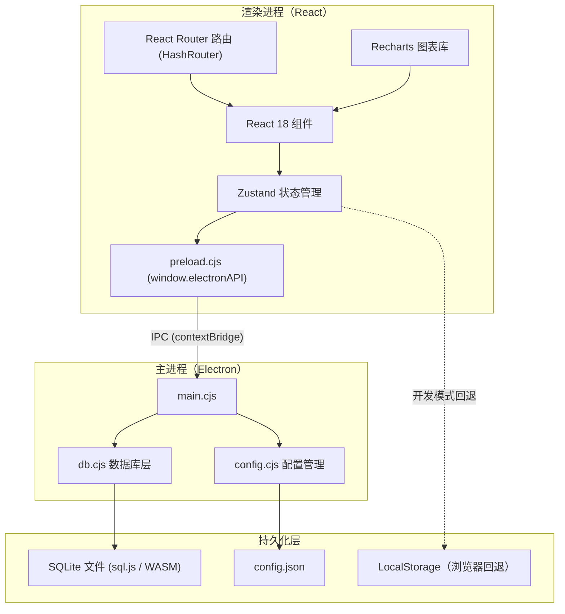
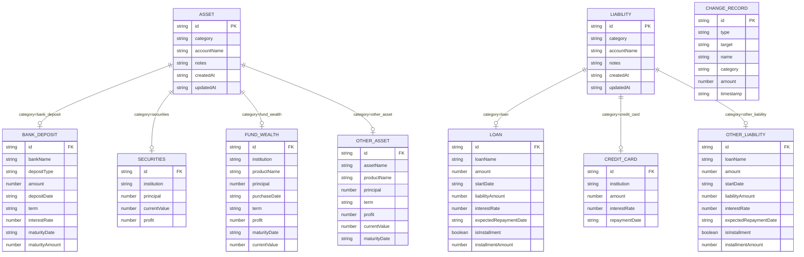
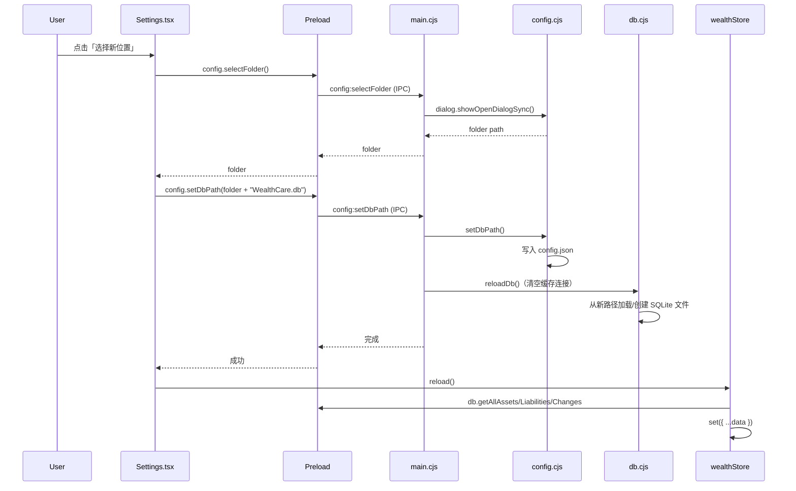

# 个人财产管理工具 - 技术架构文档

## 1. 架构设计



应用为 Electron 桌面应用，采用双进程架构：

- **渲染进程**：React 应用通过 `window.electronAPI`（preload 暴露）发起 IPC 调用
- **主进程**：处理 IPC 请求，操作 SQLite 文件与配置文件
- **持久化层**：SQLite 数据库文件 + config.json 配置文件，均位于 `%APPDATA%/wealth-tracker/`
- **浏览器回退**：开发模式下若不在 Electron 环境中，自动回退到 LocalStorage

## 2. 技术描述

- **前端**：React 18 + TypeScript + Vite 6
- **样式**：Tailwind CSS 3
- **状态管理**：Zustand 5（轻量级，适合单用户应用）
- **图表库**：Recharts 2（React 原生图表库）
- **路由**：React Router v6（HashRouter，兼容 Electron file:// 协议）
- **图标库**：lucide-react（线性图标）
- **桌面框架**：Electron 42.3.0
- **数据库**：sql.js（SQLite 的纯 WASM 实现，无需原生编译）
- **构建/打包**：electron-builder 25
- **数据持久化**：SQLite 文件（默认 `%APPDATA%/WealthCare/WealthCare.db`，位置可通过设置修改）
- **初始化**：Vite + React + TypeScript 模板

## 3. 路由定义

| 路由 | 用途 |
|------|------|
| `/` | 仪表盘总览（默认首页） |
| `/assets` | 资产管理（银行存款、证券投资、理财基金、其他资产） |
| `/liabilities` | 负债管理（贷款、信用卡、其他负债） |
| `/analysis` | 统计分析与图表 |
| `/settings` | 设置（数据库文件存放位置） |

## 4. API 定义

本应用为 Electron 桌面应用，渲染进程通过 IPC（`ipcRenderer.invoke`）与主进程通信。preload.cjs 通过 `contextBridge` 暴露 `window.electronAPI`，包含 `db` 与 `config` 两个命名空间。浏览器开发模式下若 `electronAPI` 不存在，store 自动回退到 LocalStorage。

### 4.1 IPC 通道

| 通道 | 方向 | 用途 |
|------|------|------|
| `db:getAllAssets` / `db:addAsset` / `db:updateAsset` / `db:deleteAsset` | 渲染→主 | 资产 CRUD |
| `db:getAllLiabilities` / `db:addLiability` / `db:updateLiability` / `db:deleteLiability` | 渲染→主 | 负债 CRUD |
| `db:getAllChanges` / `db:addChange` | 渲染→主 | 变动记录读写 |
| `db:migrate` | 渲染→主 | 从 LocalStorage 迁移历史数据到 SQLite |
| `config:getDbPath` | 渲染→主 | 读取当前数据库文件路径 |
| `config:getDefaultDbPath` | 渲染→主 | 读取默认数据库路径 |
| `config:selectFolder` | 渲染→主 | 弹出文件夹选择对话框 |
| `config:setDbPath` | 渲染→主 | 设置新数据库路径，并触发 `db.reloadDb()` 重新加载 |

### 4.2 数据模型类型定义

```typescript
// 资产类别
type AssetCategory = 'bank_deposit' | 'securities' | 'fund_wealth' | 'other_asset';

// 负债类别
type LiabilityCategory = 'loan' | 'credit_card' | 'other_liability';

// 银行存款
interface BankDeposit {
  id: string;
  category: 'bank_deposit';
  bankName: string;        // 银行名称
  accountName: string;     // 户名
  depositType: 'demand' | 'fixed'; // 定/活期
  amount: number;          // 金额
  depositDate: string;     // 存入日期
  term?: string;           // 期限（单位：年，可为小数）
  interestRate?: number;   // 利率（百分比，如 3 表示 3%）
  maturityDate?: string;   // 到期日（自动计算：存入日期 + 期限）
  maturityAmount?: number; // 到期金额（自动计算）
  notes?: string;          // 备注
  createdAt: string;
  updatedAt: string;
}

// 证券投资
interface Securities {
  id: string;
  category: 'securities';
  institution: string;     // 机构名称
  accountName: string;     // 户名
  principal: number;       // 本金
  currentValue: number;    // 现值
  profit: number;          // 收益（自动计算）
  notes?: string;          // 备注
  createdAt: string;
  updatedAt: string;
}

// 理财和基金
interface FundWealth {
  id: string;
  category: 'fund_wealth';
  institution: string;     // 机构名称
  accountName: string;     // 户名
  productName: string;     // 产品名称
  principal: number;       // 本金
  purchaseDate: string;    // 购买日期
  term?: string;           // 期限
  profit: number;          // 收益（自动计算）
  maturityDate?: string;   // 到期日
  currentValue: number;    // 现值
  notes?: string;          // 备注
  createdAt: string;
  updatedAt: string;
}

// 其他资产
interface OtherAsset {
  id: string;
  category: 'other_asset';
  assetName: string;       // 资产名称
  accountName: string;     // 户名
  productName: string;     // 产品名称
  principal: number;       // 本金
  term?: string;           // 期限
  profit: number;          // 收益（自动计算）
  currentValue: number;    // 现值
  maturityDate?: string;   // 到期日
  notes?: string;          // 备注
  createdAt: string;
  updatedAt: string;
}

type AnyAsset = BankDeposit | Securities | FundWealth | OtherAsset;

// 贷款
interface Loan {
  id: string;
  category: 'loan';
  loanName: string;          // 贷款名称
  accountName: string;       // 户名
  amount: number;            // 金额
  startDate: string;         // 开始日期
  liabilityAmount: number;   // 负债金额
  interestRate?: number;     // 利率
  expectedRepaymentDate?: string; // 预期还款日
  isInstallment?: boolean;   // 是否分期
  installmentAmount?: number; // 每期还款金额
  notes?: string;            // 备注
  createdAt: string;
  updatedAt: string;
}

// 信用卡
interface CreditCard {
  id: string;
  category: 'credit_card';
  institution: string;       // 发卡机构
  accountName: string;       // 户名
  amount: number;            // 金额
  interestRate?: number;     // 利率
  repaymentDate?: string;    // 到期还款日
  notes?: string;            // 备注
  createdAt: string;
  updatedAt: string;
}

// 其他负债
interface OtherLiability {
  id: string;
  category: 'other_liability';
  loanName: string;          // 贷款名称
  accountName: string;       // 户名
  amount: number;            // 金额
  startDate: string;         // 开始日期
  liabilityAmount: number;   // 负债金额
  interestRate?: number;     // 利率
  expectedRepaymentDate?: string; // 预期还款日
  isInstallment?: boolean;   // 是否分期
  installmentAmount?: number; // 每期还款金额
  notes?: string;            // 备注
  createdAt: string;
  updatedAt: string;
}

type AnyLiability = Loan | CreditCard | OtherLiability;

// 变动记录
interface ChangeRecord {
  id: string;
  type: 'add' | 'edit' | 'delete';
  target: 'asset' | 'liability';
  name: string;
  category: string;
  amount: number;
  timestamp: string;
}

// 汇总统计
interface FinancialSummary {
  totalAssets: number;
  totalLiabilities: number;
  netWorth: number;
  debtRatio: number;     // 负债率 = 总负债/总资产
  assetBreakdown: {
    bankDeposit: number;
    securities: number;
    fundWealth: number;
    otherAsset: number;
  };
  liabilityBreakdown: {
    loan: number;
    creditCard: number;
    otherLiability: number;
  };
}
```

### 4.3 自动计算规则

| 资产类别 | 计算字段 | 计算公式 |
|----------|----------|----------|
| 银行存款 | maturityDate（到期日） | depositDate + term（年），支持小数年（0.5 年 = 6 个月） |
| 银行存款 | maturityAmount（到期金额） | amount × (1 + term × interestRate / 100)，利率按百分比输入 |
| 证券投资 | profit（收益） | currentValue - principal |
| 理财和基金 | profit（收益） | currentValue - principal |
| 其他资产 | profit（收益） | currentValue - principal |

### 4.4 Store 接口定义

```typescript
interface WealthState {
  assets: AnyAsset[];
  liabilities: AnyLiability[];
  changes: ChangeRecord[];
  initialized: boolean;

  // 初始化与重载
  init: () => Promise<void>;          // 首次加载（含 LocalStorage→SQLite 迁移）
  reload: () => Promise<void>;        // 切换数据库路径后重新加载

  // 资产 CRUD（异步，返回 Promise）
  addAsset: (asset: CreateAssetInput) => Promise<void>;
  updateAsset: (id: string, asset: Partial<AnyAsset>) => Promise<void>;
  deleteAsset: (id: string) => Promise<void>;

  // 负债 CRUD（异步，返回 Promise）
  addLiability: (liability: CreateLiabilityInput) => Promise<void>;
  updateLiability: (id: string, liability: Partial<AnyLiability>) => Promise<void>;
  deleteLiability: (id: string) => Promise<void>;

  // 汇总计算
  getSummary: () => FinancialSummary;
  getAssetsByCategory: (category: AssetCategory) => AnyAsset[];
  getLiabilitiesByCategory: (category: LiabilityCategory) => AnyLiability[];
}
```

每次 CRUD 操作都会生成一条 `ChangeRecord` 并写入 `changes` 数组（保留最近 50 条），用于仪表盘「近期变动」展示。

**双模式运行**：Store 通过 `isElectron = !!window.electronAPI` 检测运行环境。Electron 模式下所有 CRUD 通过 IPC 调用主进程操作 SQLite；浏览器开发模式下回退到 LocalStorage，便于脱离 Electron 调试。

## 5. 服务器架构图

不适用（Electron 桌面应用，无独立服务器。主进程兼任本地数据服务角色，通过 IPC 与渲染进程通信）

## 6. 数据模型

### 6.1 数据模型 ER 图



### 6.2 数据存储方式

采用 sql.js（SQLite 纯 WASM 实现）持久化数据，数据库文件默认位于 `%APPDATA%/WealthCare/WealthCare.db`，路径可通过「设置」页面修改。配置文件 `config.json` 始终存于 `%APPDATA%/WealthCare/`。

**SQLite 建表语句（db.cjs 中执行）：**

```sql
-- 资产表（所有类别共用，data 字段存 JSON）
CREATE TABLE IF NOT EXISTS assets (
  id TEXT PRIMARY KEY,
  category TEXT NOT NULL,
  data TEXT NOT NULL,
  createdAt TEXT,
  updatedAt TEXT
);

-- 负债表
CREATE TABLE IF NOT EXISTS liabilities (
  id TEXT PRIMARY KEY,
  category TEXT NOT NULL,
  data TEXT NOT NULL,
  createdAt TEXT,
  updatedAt TEXT
);

-- 变动记录表
CREATE TABLE IF NOT EXISTS changes (
  id TEXT PRIMARY KEY,
  type TEXT,
  target TEXT,
  name TEXT,
  category TEXT,
  amount REAL,
  timestamp TEXT
);
```

**防抖保存**：写入操作后延迟 300ms 批量持久化到 db 文件，避免频繁 IO。

**LocalStorage 回退键名**（仅浏览器开发模式）：

```typescript
const STORAGE_KEYS = {
  ASSETS: 'wealth_tracker_assets',
  LIABILITIES: 'wealth_tracker_liabilities',
  CHANGES: 'wealth_tracker_changes',
};
```

**配置文件 config.json 结构：**

```json
{
  "dbPath": "C:\\Users\\<user>\\AppData\\Roaming\\WealthCare\\WealthCare.db"
}
```

## 7. 组件结构

```
electron/                        # Electron 主进程
├── main.cjs                     # 主进程入口（窗口、IPC 注册）
├── preload.cjs                  # 预加载脚本（暴露 window.electronAPI）
├── db.cjs                       # SQLite 数据库层（建表、CRUD、防抖保存、reloadDb）
└── config.cjs                   # 配置管理（dbPath 读写、文件夹选择）

src/
├── components/
│   ├── common/                  # 通用表单组件
│   │   ├── FormInput.tsx
│   │   ├── FormDateInput.tsx
│   │   ├── FormSelect.tsx
│   │   ├── FormTextarea.tsx
│   │   ├── FormLabel.tsx
│   │   ├── FormReadOnlyField.tsx
│   │   ├── FormRow.tsx
│   │   └── index.ts
│   ├── forms/                   # 各分类录入表单
│   │   ├── BankDepositForm.tsx  # 含 calcMaturityDate 导出（存入日期+期限计算到期日）
│   │   ├── SecuritiesForm.tsx
│   │   ├── FundWealthForm.tsx
│   │   ├── OtherAssetForm.tsx
│   │   ├── LoanForm.tsx
│   │   ├── CreditCardForm.tsx
│   │   └── OtherLiabilityForm.tsx
│   └── Layout.tsx               # 全局布局（左侧导航 + 右侧内容）
├── pages/
│   ├── Dashboard.tsx            # 仪表盘总览
│   ├── Assets.tsx               # 资产管理（含筛选、表头排序、自动计算到期日/到期金额/收益）
│   ├── Liabilities.tsx          # 负债管理（含表头排序）
│   ├── Analysis.tsx             # 统计分析（资产/负债分布饼图、对比柱状图、按月趋势折线图、按月汇总表）
│   └── Settings.tsx             # 设置（数据库位置管理）
├── store/
│   └── wealthStore.ts           # Zustand 状态管理（双模式、init/reload）
└── types/
    └── index.ts                 # TypeScript 类型定义
```

## 8. 资产筛选功能实现

### 8.1 筛选状态

```typescript
const [filterInstitution, setFilterInstitution] = useState('');
const [filterAccountName, setFilterAccountName] = useState('');
const [filterDepositType, setFilterDepositType] = useState<'all' | 'fixed' | 'demand'>('all');
```

### 8.2 筛选逻辑

筛选在组件层完成（非 store 层），基于当前 `selectedCategory` 对资产列表进行二次过滤：

- **机构名称**：按分类映射到不同字段（bankName / institution / assetName），文本模糊匹配，不区分大小写
- **户名**：匹配 accountName 字段，文本模糊匹配，不区分大小写
- **定/活期**：仅银行存款分类生效，匹配 depositType 字段，下拉精确匹配

### 8.3 字段映射

| 分类 | 机构名称筛选字段 |
|------|------------------|
| bank_deposit | bankName |
| securities | institution |
| fund_wealth | institution |
| other_asset | assetName |

### 8.4 交互行为

- 切换分类标签时重置所有筛选条件
- 筛选区域始终展示，定/活期筛选项仅在银行存款分类下显示
- 有任意筛选生效时显示「重置」按钮
- 记录数显示「（已筛选）」标识

## 9. 设置功能实现（数据库位置管理）

### 9.1 模块分工

| 模块 | 职责 |
|------|------|
| `electron/config.cjs` | 读写 `config.json`、提供 `getDbPath/setDbPath/getDefaultDbPath/selectFolder` |
| `electron/db.cjs` | `getDb()` 从 config 读取路径；`reloadDb()` 重置连接并重新加载 |
| `electron/main.cjs` | `registerConfigHandlers()` 注册 4 个 config IPC handler |
| `electron/preload.cjs` | 暴露 `window.electronAPI.config` |
| `src/pages/Settings.tsx` | 设置页面 UI，调用 config API 并触发 `store.reload()` |
| `src/store/wealthStore.ts` | `reload()` 重新从 SQLite 读取数据刷新状态 |

### 9.2 切换数据库位置流程



### 9.3 注意事项

- 配置文件 `config.json` 始终位于 `%APPDATA%/WealthCare/`，不随数据库位置变化
- 切换位置后**不会自动迁移**原数据库内容，用户需手动复制 `WealthCare.db` 文件
- 新位置若不存在 db 文件，自动创建空数据库并初始化表结构
- `reload()` 不执行 LocalStorage 迁移逻辑（仅 `init()` 首次启动时执行）

## 10. 构建与打包

| 命令 | 用途 |
|------|------|
| `npm run dev` | 启动 Vite 开发服务器（纯浏览器模式，LocalStorage 回退） |
| `npm run dev:electron` | Electron 开发模式（同时启动 Vite 与 Electron） |
| `npm run build:win:setup` | 打包为 Windows NSIS 安装程序（输出 `dist-electron/WealthCare-1.0.0-setup.exe`） |
| `npm run build:win:dir` | 打包为 Windows 目录版（输出到 `dist-electron/win-unpacked/WealthCare.exe`） |
| `npm run build:win:portable` | 打包为单文件 portable exe |

**打包配置要点**（package.json build 字段）：
- `build.files` 需包含 `node_modules/sql.js/dist/**/*`（sql.js 的 WASM 文件）
- `build.directories.output` 设为 `dist-electron`（避免旧目录占用导致打包失败）
- `win.target` 同时配置 `nsis` 与 `portable`，可同时产出安装版与便携版
- `nsis` 配置：`oneClick: false`（非一键安装）、`allowToChangeInstallationDirectory: true`（允许修改安装目录）、创建桌面与开始菜单快捷方式
- 主进程文件需使用完整文件名 `require('./db.cjs')`（不能省略 `.cjs` 扩展名）
